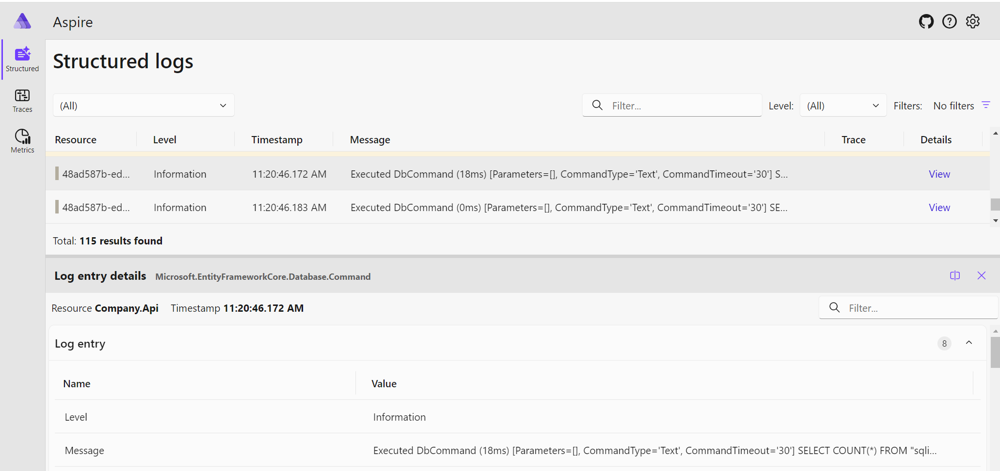
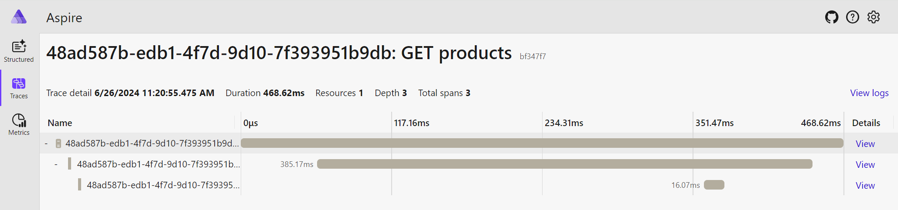
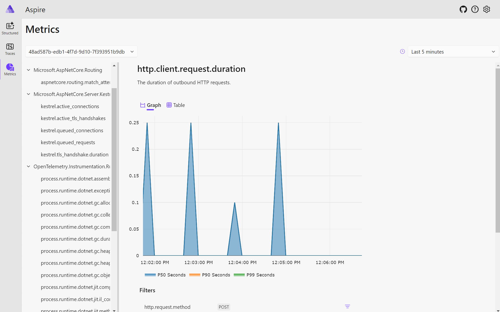

# Distributed monitoring in dotnet

I want a cheap centralised monitoring solution as I start building out more services and more infrastructure for hobby projects.

After some research, this is achievable using two open source components:
1. **OpenTelemetry** - libraries that collect telemetry data and export it in a standardised format. The libraries are free, open-source, and generally available across [multiple languages](https://opentelemetry.io/docs/instrumentation/).
2. **.NET Aspire** - an app that accepts OpenTelemetry formatted data, stores it in memory, and presents it via a dashboard.

## Data generation (OpenTelemetry)

The OpenTelemetry libraries do all of the heavy lifting, although they do need to be configured correctly. For my app, I used the following:

```
OpenTelemetry.Api.ProviderBuilderExtensions
OpenTelemetry.Exporter.OpenTelemetryProtocol
OpenTelemetry.Extensions.Hosting
OpenTelemetry.Instrumentation.AspNetCore
OpenTelemetry.Instrumentation.EntityFrameworkCore
OpenTelemetry.Instrumentation.Runtime
```

### Logs

Add OpenTelemetry to your logging when configuring your app:

```csharp
builder.Logging.AddOpenTelemetry(logging =>
{
    logging.IncludeFormattedMessage = true;
    logging.IncludeScopes = true;
});
```

### Traces & Metrics

**Traces** are required to create flame graphs, visualising the call stack of a request / process. **Metrics** are important to monitor the health of your app, for example http client requests, open connections, GC heap size.

##### Automatic instrumentation

Automatic instrumentation is simple to set up, and there are already libraries for most of the things you want to monitor. An example of how you can configure metrics & tracing is as follows:

```csharp
var serviceName = Assembly.GetExecutingAssembly().GetName().Name.ToString();
var serviceVersion = Assembly.GetExecutingAssembly().GetName().Version.ToString();
var appResourceBuilder = ResourceBuilder.CreateDefault()
    .AddService(serviceName: serviceName, serviceVersion: serviceVersion);
builder.Services
    .AddMetrics()
    .AddOpenTelemetry()
    .ConfigureResource(c => c.AddService(serviceName))
    .WithMetrics(metricProviderBuilder => metricProviderBuilder
        .AddMeter(
            "Microsoft.AspNetCore.Hosting",
            "Microsoft.AspNetCore.Server.Kestrel",
            "System.Net.Http",
            serviceName)
        .SetResourceBuilder(appResourceBuilder)
        .AddAspNetCoreInstrumentation()
        .AddRuntimeInstrumentation())
    .WithTracing(tracerProviderBuilder => tracerProviderBuilder
        .AddSource(serviceName)
        .SetResourceBuilder(appResourceBuilder)
        .AddAspNetCoreInstrumentation()
        .AddEntityFrameworkCoreInstrumentation());
```

Further reading: https://opentelemetry.io/docs/instrumentation/net/automatic/

##### Manual instrumentation

If you have any operations you need to monitor that are not covered in the automatic instrumentation, for example some in memory processing, you can create your own ActivitySource and create custom spans.

```csharp
public class Filter
{
    private static readonly ActivitySource MyActivitySource = new(nameof(Filter), "1.0.0");

    public ICollection<T> ApplyFilter(ICollection<T> input, Func<T, bool> filter)
    {
        using var activity = MyActivitySource.StartActivity("ApplyFilter");
        # your filtering code
    }
}
```

When adding an activity source, ensure you register it accordingly, else the activity monitor won't subscribe to it and you won't get your custom traces:

```csharp
    .WithTracing(tracerProviderBuilder => tracerProviderBuilder
        .AddSource(serviceName, nameof(Filter)) // add all classes with an activity source here
```

Further reading: https://opentelemetry.io/docs/instrumentation/net/manual/

## Exporting data (OpenTelemetry)

Depending on your exporter the configuration will be different. Whilst getting things off the ground I used the console exporter (NuGet package OpenTelemetry.Exporter.Console) as follows:

```csharp
builder.Services.AddOpenTelemetry()
    .WithTracing(
        tracerProviderBuilder => tracerProviderBuilder.AddConsoleExporter()
    );
```

Further reading: https://opentelemetry.io/docs/instrumentation/net/exporters/

## Data collection (.NET Aspire)

> .NET Aspire is an opinionated, cloud ready stack for building observable, production ready, distributed applications.

Running the dashboard is simple, and can be done with the following command:

```cmd
docker run --rm -it -p 18888:18888 -p 18889:18889  mcr.microsoft.com/dotnet/aspire-dashboard:8.0
```

The two mapped ports are for the following:
`18888` - Dashboard endpoint
`18889` - OTLP endpoint

.NET Aspire docs: https://learn.microsoft.com/en-us/dotnet/aspire/get-started/aspire-overview

Once the dashboard is running, you need to configure your app to send data to it. This is done by setting `OTEL_EXPORTER_OTLP_ENDPOINT` (e.g. http://localhost:18889), and then configuring the OTLP exporter as follows:

```csharp
builder.Services.Configure<OpenTelemetryLoggerOptions>(options => options.AddOtlpExporter())
    .ConfigureOpenTelemetryMeterProvider(metrics => metrics.AddOtlpExporter())
    .ConfigureOpenTelemetryTracerProvider(tracing => tracing.AddOtlpExporter());
```

### CICD

I copy the .NET Aspire Dashboard image to my Azure Container Registry [here](../../.github/workflows/permanent-image-import.yml), and deploy it using terraform [here](../../terraform/instance/container_apps.tf#L77).

## Data visualisation (.NET Aspire)

All data sent from your app to the aspire dashboard is available through the dashboard (e.g. http://localhost:18888)

### Logs



### Traces



### Metrics


