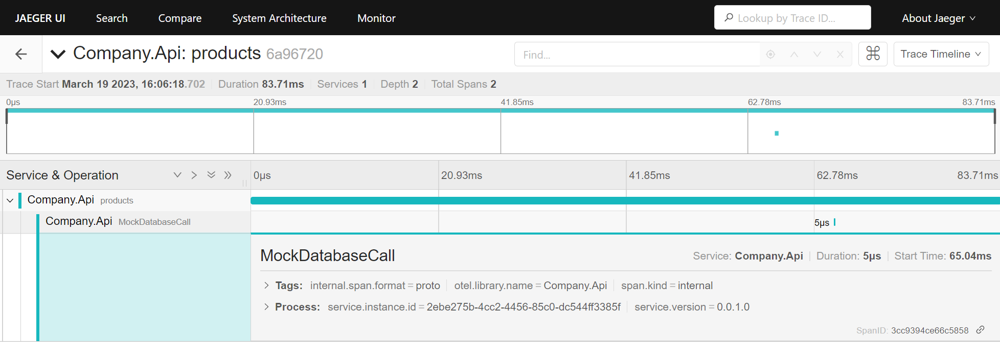

# Distributed tracing in dotnet

I wanted to implement a cheap centralised tracing solution as I start building out more services and more infrastructure for a hobby project. After some Google-ing, OpenTelemetry seems to be the modern way to do this. At it's core, it is a bunch of libraries that collect telemetry data and export it in a standardised format, and there are loads of third party tools that can visualise data in this format. The libraries are free, open-source, and generally available across [multiple languages](https://opentelemetry.io/docs/instrumentation/).

For simple systems, you can achieve centralised tracing in three steps:
1. Configure your app(s) to generate and export temeletry data,
2. Set up a data collector (multiple options available, I use Jaeger-all-in-one),
3. Set up a data visualiser (multiple options available, I use Jaeger-all-in-one).

OpenTelemetry docs: https://opentelemetry.io/docs/

## Generating and exporting OpenTelemetry data

#### Data generation - automatic instrumentation

Automatic instrumentation is simple to set up, and it gives you lots of useful data. After installing a NuGet package and adding a couple of lines of code, your app will automatically generate telemetry data for common operations. Some examples are:
* [ASP.NET Core](https://github.com/open-telemetry/opentelemetry-dotnet/blob/main/src/OpenTelemetry.Instrumentation.AspNetCore/README.md) - generates metrics and traces for incoming web requests.
* [HTTP Client](https://github.com/open-telemetry/opentelemetry-dotnet/blob/main/src/OpenTelemetry.Instrumentation.Http/README.md) - generates metrics and traces for outgoing web requests.
* [SQL Client](https://github.com/open-telemetry/opentelemetry-dotnet/blob/main/src/OpenTelemetry.Instrumentation.SqlClient/README.md) - generates metrics and traces for database operations.
* etc etc...

**However** - I have not looked into the performance hit. When using similar libraries in the past I've experienced some serious performance degredation. It's something to watch out for with these 'auto-magic' libraries!

OpenTelemetry docs: https://opentelemetry.io/docs/instrumentation/net/automatic/

#### Data generation - manual instrumentation

If you have any operations not covered in the automatic instrumentation you'd like to monitor, generating custom traces is easy. OpenTelemetry will join traces in child methods to the parents etc for you!

```csharp
public class Filter
{
    public static readonly ActivitySource MyActivitySource = new("my app");

    public ICollection<T> ApplyFilter(ICollection<T> input, Func<T, bool> filter)
    {
        using var activity = MyActivitySource.StartActivity("ApplyFilter");
        # your filtering code
    }
}
```

OpenTelemetry docs: https://opentelemetry.io/docs/instrumentation/net/manual/

#### Exporting data

Exporting is easy - a NuGet package and a bit of code.

```powershell
dotnet add package OpenTelemetry.Exporter.Console
```

```csharp
builder.Services.AddOpenTelemetry()
    .WithTracing(
        tracerProviderBuilder => tracerProviderBuilder.AddConsoleExporter()
    );
```

OpenTelemetry docs: https://opentelemetry.io/docs/instrumentation/net/exporters/

## Data collection (Jaeger tracing)

My requirements for data collection and visualisation were that it's open-source, self hosted, and can use a simple data store. I discovered Jaeger - a distributed tracing system released by Uber. Whilst you can configure Jaeger to support distributed, highly available architectures, it also has an all-in-one deployment which uses memory storage. For me, that's fine. For details on how to run Jaeger locally, follow this guide: https://www.jaegertracing.io/docs/1.42/getting-started/#all-in-one

> All-in-one is an executable designed for quick local testing, launches the Jaeger UI, collector, query, and agent, with an in memory storage component.

Once I had a running instance of Jaeger, I configured my app to export it's data to the Jaeger all-in-one app.

```csharp
builder.Services.AddOpenTelemetry()
    .WithTracing(
        tracerProviderBuilder => tracerProviderBuilder.AddOtlpExporter(opt => opt.Endpoint = "http://<ip_address>:4317")
    );
```

Jaeger docs: https://www.jaegertracing.io/

### CICD

I copied the Jaeger all-in-one public image to my Azure Container Registry using [this workflow](../../.github/workflows/shared-image-import.yml). I then deployed an Azure Container Instance using this image, opening the ports for the front end (16686) and the Open Telemetry Protocol via GRPC (4317). This is deployed by terraform so you can see the full configuration [here](../../terraform/instance/container_instances.tf).

## Data visualisation (Jaeger tracing)

As I am using all-in-one Jaeger deployment, data visualisation is already there - I can visit the Jaeger front end (port 16686) and search traces coming in from my API:


I can drill into individual traces and see the individual spans (although it's not very exciting at the moment):



## Summary

Collecting and visualising telemetry data is a great addition to my system. Whilst the in memory solution isn't scalable or suitable for a live system, having tracing in place early will encourage me to think about observability from the start and help me debug performance issues quickly.
